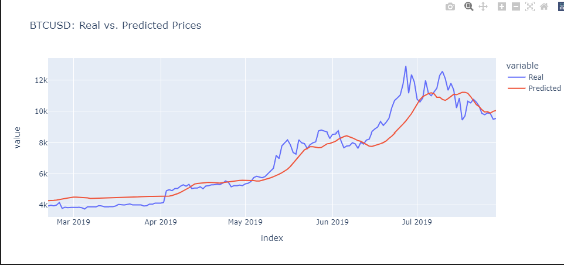
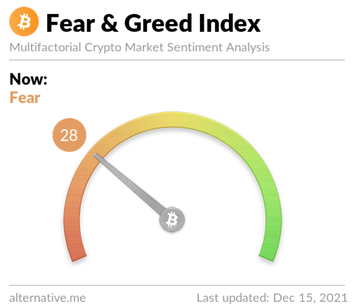

>## *Predict Bitcoin prices with LSTM*  
#
#### Quick Start with Pip
```bash
pip install -r requirements.txt
```
##


<br clear="center"/>


#

>### Overview: 
>> This script will *build* & *evaluate* deep learning models using both the Fear & Greed (FNG) values and simple closing prices to determine if the FNG indicator provides a better signal for cryptocurrencies than the normal closing price data.

>> One model will use the FNG indicators to predict the closing price while the second model will use a window of closing prices to predict the nth closing price.


<br clear="center"/>

#

>## What is FNG?
> [Zignaly](https://zignaly.com/crypto-knowledge-base/crypto-fear-and-greed-index/#:~:text=A%20Bitcoin%20fear%20and%20greed%20index%2C%20created%20by,when%20investors%20may%20be%20too%20greedy%20or%20fearful.): A Bitcoin fear and greed index, created by the Alternative.me platform, is used to analyze emotions and sentiments from various sources before crunching them into a number. As with traditional trading markets, the crypto greed and fear index ranges from zero to 100, indicating when investors may be too greedy or fearful.
>

<br clear="center"/>

## Resources:
1. Northwestern NPS:
https://sps.northwestern.edu/

2. Zignaly:
https://zignaly.com/crypto-knowledge-base/crypto-fear-and-greed-index/#:~:text=A%20Bitcoin%20fear%20and%20greed%20index%2C%20created%20by,when%20investors%20may%20be%20too%20greedy%20or%20fearful.

3. Alternative.me:
https://alternative.me/crypto/fear-and-greed-index/